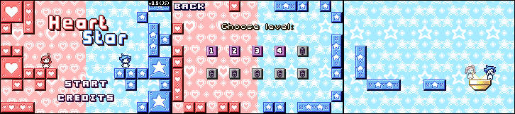

[Heart Star][demo]
==================

>   A port of the game originally created by [Jussi Simpanen][advi] for [Ludum
>   Dare 30][ld-g], Theme: "Connected Worlds".




Story
-----

>   Two friends want to reach the same place together but they have a little
>   problem: They live in completely different worlds! Help the friends reach
>   the common goal while swapping between the red and blue world. While the
>   friends might not be able to see each others worlds, they can still
>   interact by serving as a platform or carrying each other.


Project Motivation and Objective
--------------------------------

'Heart Star' is a Flash game, designed and created using the game authoring
software Stencyl.

For educational purposes, I took the opportunity and wrote this HTML/JavaScript
port, using [Phaser][phsr].

This port is a remake of the Ludum Dare version, aiming to be accurate as the
original game as possible. None of the subsequent updates of the original game
are planned to be ported, though.


Game Controls
-------------

*   Use the arrow keys (`↑`, `←` and `→`) to move and jump.
*   Use the space bar (`␣`) to switch between worlds and control a different
    character.
*   Use the back space key to restart a level wherever you need.
*   Use the escape key (`esc`) to quit the a game level.


Development Instructions
------------------------

Download and extract the [packaged project][dwld], or clone this repository
locally. The following npm scripts are available to you, performing the tasks
described.

```
npm install   # Installs all required project dependencies.
npm start     # Launches the server and opens the page for live development.
npm run dist  # Prepare the game release for distribution.
npm run clean # Wipes temporary and distribution files.
```


### Features ##################################################################

*   Game ported with [Phaser][phsr] framework.

*   Game levels and some background images composed using [Tiled Map
    Editor][tild].

*   Graphics converted into Texture Atlases using [`gulp.spritesmith`][gsps].

*   Uses [localForage][lfor] for game data storage management.

*   All game code written in JavaScript (ECMAScript 2015), compiled with
    [Babel][babl] for compatibility with today browsers.

*   [BrowserSync][bsnc] as development server.

*   [Gulp][gulp] task manager.

*   Development environment compatible with [Node][node].


Licensing
---------

Source code distributed under the terms of the [MIT License](LICENSE).

Original game project by Jussi Simpanen, shared under a [Creative Commons 3.0
Atribution—Non-Commercial—Share-Alike Unported][cc-l] license. All remixed
artwork used in this version of the game is redistributed under the [same
license][cc-l].


<!-- ---------------------------------------------------------------------- -->

[phsr]: https://phaser.io/
[babl]: https://babeljs.io/
[gulp]: https://gulpjs.com/
[node]: https://nodejs.org/
[bsnc]: http://browsersync.io/
[tild]: http://www.mapeditor.org/
[advi]: http://simpanen.carbonmade.com/
[demo]: https://rblopes.github.io/heart-star/
[lfor]: https://mozilla.github.io/localForage/
[gsps]: https://github.com/twolfson/gulp.spritesmith
[cc-l]: https://creativecommons.org/licenses/by-nc-sa/3.0/
[dwld]: https://github.com/rblopes/heart-star/archive/master.zip
[ld-g]: http://ludumdare.com/compo/ludum-dare-30/?action=preview&uid=11391
