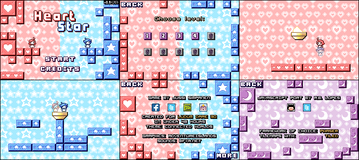

[Heart Star][demo]
==================

>   A port of the game created by [Jussi Simpanen][advi] for [Ludum Dare 30
>   "Connected Worlds"][ld-g].




Story
-----

>   Two friends want to reach the same place together but they have a little
>   problem: They live in completely different worlds! Help the friends reach
>   the common goal while swapping between the red and blue world. While the
>   friends might not be able to see each others worlds, they can still
>   interact by serving as a platform or carrying each other.


Game Controls
-------------

*   Use the arrow keys (`↑`, `←` and `→`) to move and jump.
*   Use the space bar (`␣`) to switch between worlds and control a different
    character.
*   Use the back space key to restart a level wherever you need.
*   Use the escape key (`esc`) to quit the game level.


Development Instructions
------------------------

Download and extract the [packaged project][dwld], or clone this repository
locally. The following npm scripts are available to you, performing the tasks
described.

```
npm install   # Installs all required project dependencies.
npm start     # Launches the server and opens the page for live development.
npm run dist  # Prepare the game release for distribution.
npm run clean # Wipes temporary and distribution files.
```


About this Project
------------------

'Heart Star' was originally designed as a Flash game, created using the game
authoring software [Stencyl][stcl]. For learning purposes, I developed this web
application port using [Phaser][phsr].

This port is a remake of the [published Ludum Dare version][ld-g], aiming to be
as accurate like the original game as possible.


### Features ##################################################################

*   Game ported with [Phaser][phsr] game framework.

*   Game levels composed using [Tiled Map Editor][tild].

*   Graphics converted into Texture Atlases using [`gulp.spritesmith`][gsps].
    Either [GraphicsMagick][gm..] or [ImageMagick][imgk] is required to use
    this feature.

*   Uses [localForage][lfor] for game data storage management.

*   All game code written in JavaScript (ECMAScript 2015), compiled with
    [Babel][babl] for compatibility with today browsers. Game code bundled with
    [Browserify][brsy].

*   [BrowserSync][bsnc] integrated as development server.

*   Uses [Gulp][gulp] for development task management.

*   Developed with [Node.js][node].


Licensing
---------

Source code under the [MIT License](LICENSE).

Original game project, including code and game assets, created by Jussi
Simpanen, shared under a [Creative Commons Attribution-NonCommercial-ShareAlike
3.0 Unported][cc-l] license. All remixed artwork shared under the [same
license][cc-l].


<!-- ---------------------------------------------------------------------- -->

[phsr]: https://phaser.io/
[babl]: https://babeljs.io/
[gulp]: https://gulpjs.com/
[node]: https://nodejs.org/
[brsy]: http://browserify.org/
[bsnc]: http://browsersync.io/
[stcl]: http://www.stencyl.com/
[tild]: http://www.mapeditor.org/
[imgk]: http://www.imagemagick.org/
[gm..]: http://www.graphicsmagick.org/
[advi]: http://simpanen.carbonmade.com/
[demo]: https://rblopes.github.io/heart-star/
[lfor]: https://mozilla.github.io/localForage/
[gsps]: https://github.com/twolfson/gulp.spritesmith
[cc-l]: https://creativecommons.org/licenses/by-nc-sa/3.0/
[dwld]: https://github.com/rblopes/heart-star/archive/master.zip
[ld-g]: http://ludumdare.com/compo/ludum-dare-30/?action=preview&uid=11391
